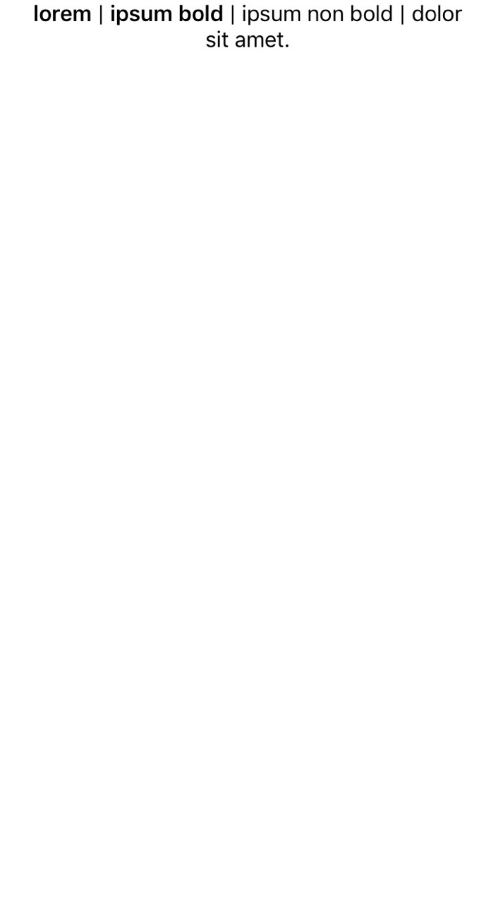

# NSMutableAttributedString Interpolations
This extension allows you to simply replace String format specifiers (ie. `%@`, `%1$@`) with other NSAttributedString and still keeping the styling that comes with it!

## Usage

Assuming you've defined the `NSAttributedString` and `boldAttributes` earlier:

```Swift 
let attributedString1 = NSAttributedString(string: "lorem", attributes: boldAttributes)
let attributedString2 = NSAttributedString(string: "ipsum bold", attributes: boldAttributes)
let attributedString3 = NSAttributedString(string: "ipsum non bold")
```

Implementation would be as simple as:

```Swift
let finalText = "%@ | %@ | %@ | dolor sit amet."
let finalString = NSMutableAttributedString(string: finalText).format(with: attributedString1, attributedString2, attributedString3)
```

The result would then be:

<p align='center'>
  
</p>
